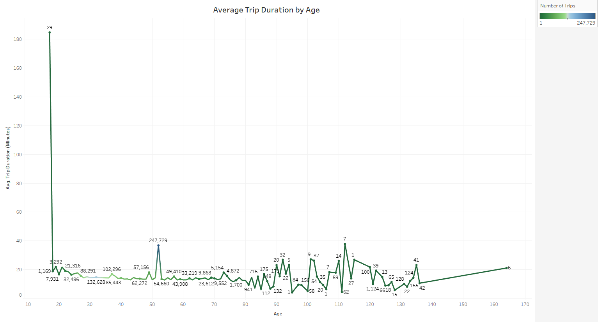

# Tableau---Citi-Bike-Analytics (March - 2018, 2019, 2020):
--- 

- Below is the link for the Tableau Published Website for the 'Citi Bike Data Analysis for the month of March - 2018, 2019 and 2020'.

[Citibike_Assignment_MQ](https://public.tableau.com/app/profile/mubashira.qari/viz/Citibike_Assignment_MQ/Story1-CitiBikeAnalytics?publish=yes)

**Discovered Phenomena-1:** There is a significant drop in the ridership growth for the year 2020, compared to 2019 and 2018. The prominent factor responsible for the drop in the number of riders might be the pendamic. The time, 5:00 pm  turned out to be the most popular time to start the ride in all three years for the month of March.
Below are the presentations for the discovered phenomena-1.

- Chart for the number of trips per year is created and further comparision by weeks is provided. 

- The ridership growth rate is calculated and presented in the chart.

- The annual subscriber and customer's counts are projected in the chart.

- Peak time for the riders is recorded for the month of March in all three years.

- A dashboard1 is created for all the above projections.

**Discovered Phenomena-2:** Pershing Square North, turned out to be the most popular starting and ending station in New York. Male are the highest number of riders in all three years. The line chart of  'Average Trip Duration by Age',  shows that there are questionable entries in the 'Birth Year' column, since the values are reaching to age 164 .

- Most popular start station for all three years is presented in the chart.

- Most popular end station for all three years is presented in the chart.

- Gender breakdown is shown by comparing the distribution among all three years.

- Average trip duration is presented by age.

- A dashboard2 is created for all the above projections.

**Discoverd Phenomena-3:** Though Pershing Square North is the most popular start an end station in the month of march, for all three years, but the popularity count drops in the year 2020. The factor responsible for the drop might be the pendemic.

- A static map for the most popular start stations is created.

- A static map for the most popular end stations is created.

- A dashboard3 is created for all the above projections.

- A story is published on the Tableau Public Website. The link is provided below.

[Citibike_Assignment_MQ](https://public.tableau.com/app/profile/mubashira.qari/viz/Citibike_Assignment_MQ/Story1-CitiBikeAnalytics?publish=yes)

